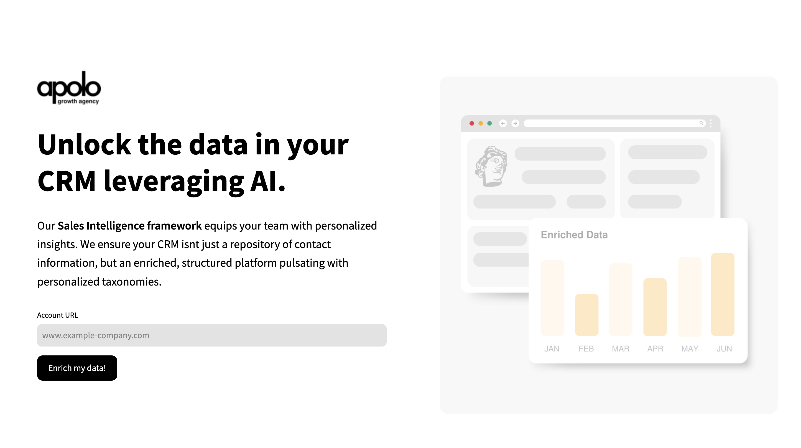

# Sales Intelligence by Apolo

Apolo's Sales Intelligence framework transforms your CRM into an enriched platform with personalized insights, leveraging a robust tech stack:

## Technology Stack

- **OpenAI APIs**: [OpenAI](https://openai.com/)
- **Llama Index**: [Llama Index](https://www.llamaindex.com/)
- **ZenRows**: [ZenRows](https://www.zenrows.com/)
- **Google Cloud Platform**: [GCP](https://cloud.google.com/)
- **Lamini AI**: [Lamini AI](https://www.lamini.ai/)

These technologies are integrated to offer:

- Personalized Insights
- Lookalike Building
- Real-time Insights
- Personalized Categorization

## Value Proposition

Integrate our services to enhance your sales intelligence and revenue.

## Specific Use Cases

Explore specific use cases at `/use_cases`.

## One-shot Demo

Try the demo at [demo-llm-enrich.onrender.com](https://demo-llm-enrich.onrender.com).

Visit [Apolo Marketing - Sales Intelligence](https://www.apolomarketing.net/sales-intelligence) for more details.

